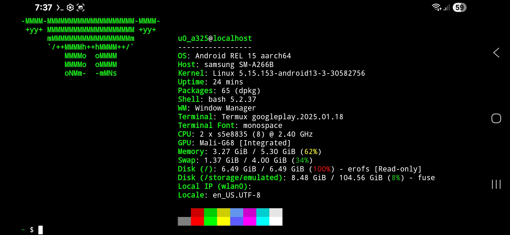
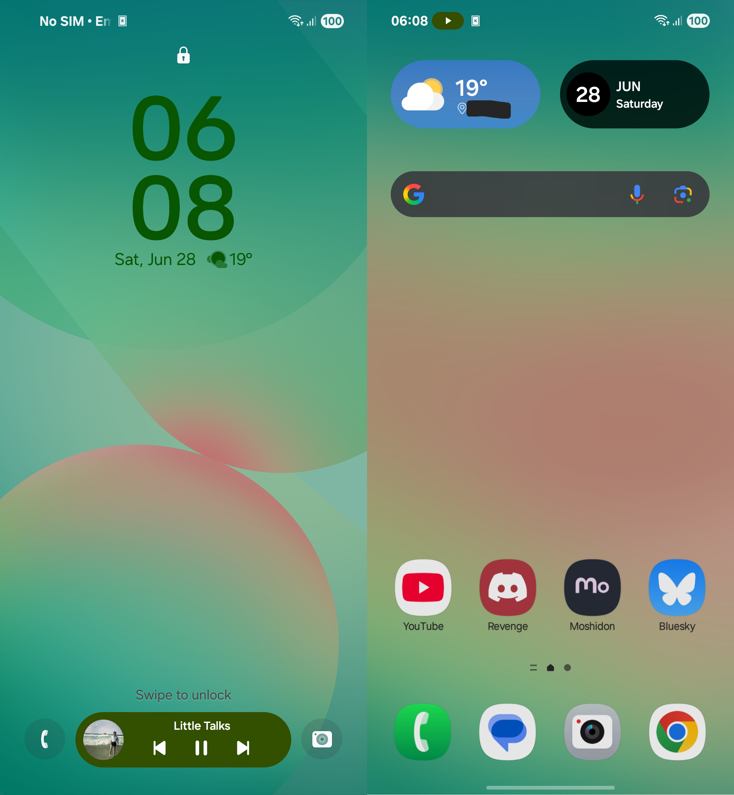
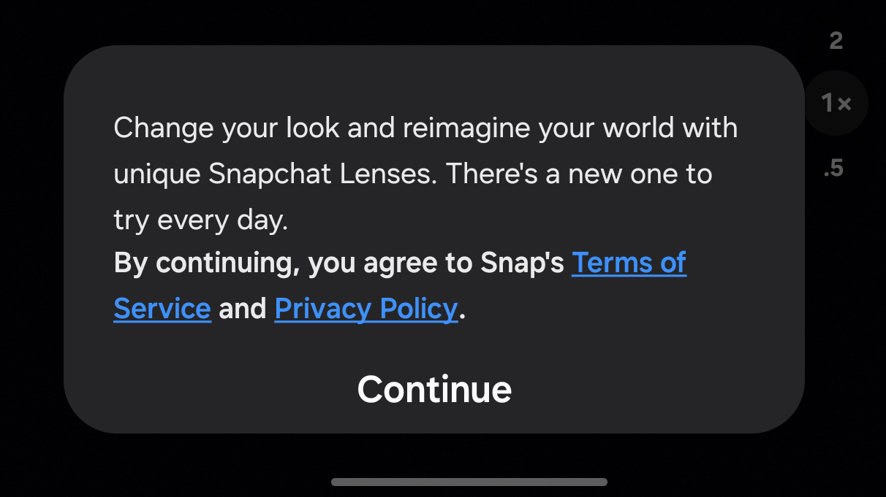

[Last time](/lynxblog/2023/03/05/galaxy-a23-5g-one-month-review-why-switched.html), I said I will keep my previous phone (my then-new Galaxy A23 5G) as my main for at least 1-2 years. I initially got it in late January 2023, and it's been frankly almost 2 years and 6 months since then!

The initial plan later on was to keep this phone as my main for another 2 years before moving on to another phone, as I had thought that there was basically just barely any innovation 'n stuff nowadays or like just any reason whatsoever to upgrade my phone when it *was still working just fine*, and I thought I wasn't missing out on anything really.

However, later on I realized that the phone was only entitled to **2 major Android version upgrades**, not 3 like I initially thought this whole time! The phone came out around the end of summer 2022, so out-of-the-box it only came with Android 12. This means that (for better or worse) it can only be officially upgraded to Android 14 with One UI 6.

This however wasn't a big issue for me as at some point my phone usage was gonna drop to 1 hour at most, mostly consisting of stuff like checking socials, weather or whatever I needed to check, or putting notes and reminders for myself. At some point I did also have issues arise with the phone's charging port (Sep-Oct 2024), but they since thankfully faded away.

With everything out of the way, the A23 5G was an actually good midrange Galaxy phone for its time, and still works well enough to this day, at least for "basic tasks" like what I've been using it for.

However at the end of the day I just ended up getting a different phone: the **Galaxy A26 5G**. To my defense, it was just given to me in an all-new condition, *literally waiting to be set up. It was already powered on displaying the first-time setup experience*. I was literally just handed over the phone with its entire box and its contents, that's it.

*i use android btw*

## Basic specifications
The **Galaxy A26 5G** is a rather recently-released Galaxy phone. It was announced on [2 March 2025](https://en.wikipedia.org/wiki/Samsung_Galaxy_A26_5G), with availability by region by 19 March 2025. Frankly not too long ago!

Out-of-the-box it comes with **Android 16 (One UI 7)**, not supported on the Galaxy A23 5G! Aaand oh boy, things are quite interesting in One UI 7, I'll get to it later
<small>(TL;DR: signficant refresh to the UI! It feels so fresh compared to previous One UIs :D)</small>

Some upgrades on the A26 5G compared to the A23 5G:
- **AMOLED is back!** Every Galaxy phone I had since 2019 were literally all LCD displays. Yes I consider AMOLED an upgrade, things on screen look cooler and with pitch black dark mode it helps improve battery life
   - Just like the A23 5G, this phone also supports **120Hz refresh rate**, to complete the display side of things
- **IP67 dust/water resistance**, up to 1m for 30 minutes. Not really a very important feature for me but nice to have
- **Base variants come with 128GB internal storage**, double from the 64GB of the A23 5G. That is literally just as much as the SSDs of some of my laptops!
   - The phone still comes with an microSD slot so the 128GB of storage can be expanded!

Not-so upgrades compared to the A23 5G:
- ***No headphone jack!*** Samsung decided to go full iPhone 7 with this one. Not that I use wired headphones that often, I've went the wireless path for some time but I've been still sometimes using wired headphones
- The phone only comes with an in-house **Exynos** chip, as opposed to the A23 5G which comes with an **Qualcomm Snapdragon** chip
    - However, whether Exynos or Snapdragon is better was never an issue for me, personally both always did their job just as well
- The base variants **only come with 4GB RAM**. Still.
    - However, my variant has 6GB of RAM. Neat! Again, not that I will really use my phone for anything other than "basic tasks" primarily, and the 4GB of RAM on the A23 5G served me well enough.
- Still ***no seamless updates***.
    - Better late than never, recent Galaxy phones finally come with seamless updates supported. [However, for some reason, Samsung omitted the A26 5G](https://r2.community.samsung.com/t5/Galaxy-A/Samsung-Galaxy-A26-Update-and-Seamless-Updates/td-p/19010213) and I can confirm it rather *still* updates the old-fashioned way. This is a ""funny"" yet sad move from Samsung that literally makes no sense at all (and idk how surprised i should be about it in the first place), like how can you 9 years later still be attached to the old-style way of updating when there's a better alternative??
    - For those uninitiated, [**seamless updates**](https://source.android.com/docs/core/ota/ab) work by downloading and installing the update in the background, and then restarting immediatelly lets you into the updated system, thanks to having A/B partitions. 
       - In the other hand, the [**non-A/B update mechanism**](https://source.android.com/docs/core/ota/nonab) used by the A26 5G <small>(and most older Galaxy phones)</small> involves downloading the update then booting into Recovery Mode to apply the update. As the update screen warns, *it is impossible to then fallback to the previous software,* and the phone basically becomes a brick while it updates

Other than that, nothing much really significant about the A26 versus A23.

## The software
As previously said above, the Galaxy A26 5G comes with Android 15 (One UI 7). Unlike the A23 5G, the A26 5G is entitled for **6 major Android version upgrades**, which is a huge step-up meaning I won't have to worry about missing any new Android version for a while

Now say what you want about it but One UI 7 for me personally *geniunely feels like a refresher* compared to every previous One UI since 2019. At first when I saw One UI 7's look I was like eh, but when actually using it, it geniunely feels like a "new and exciting" thing, and so far never ran into any issues with the software specifically.

Something you'd have to get used to when going from One UI 6 (or anything previous) to 7 is the fact the Notifications panel and the control center are now separate from each other, accessible from two separate parts of the screen from the top.

### Preinstalled apps
No significant differences, they are mostly the same except bearing the new One UI 7 look. The phone continues to come preinstalled with apps like Facebook and Netflix. Both can be uninstalled, but the same cannot be said for the former's accompanying Meta App Installer, Meta App Manager and Meta Services apps, which ***can only be disabled***.

[Just like the A23 5G](https://wetdry.world/@lynxmic/109757111919386114), it still comes with this **Samsung Free** app <small>(which like who even uses it lmao)</small>, however **you can actually uninstall it**. This is as opposed to the A23 5G where you literally cannot even disable it, let alone uninstall it, as if it's """essential""" (no it's not).

### AI stuff
Unlike on the A23 5G which launched at a time when AI wasn't popular <small>(ChatGPT didn't even launch yet!)</small>, the A26 comes with Google's Gemini AI chatbot preinstalled as a system app which can only be disabled. **There are also Galaxy AI features as well**, but they do not really serve a true purpose for me personally at least... maybeee for those who are actually fans of AI, I ain't one of them

They're just there to be there, because they're basically AI and it's a trend for literally every major tech company at this point, but that's a whole different story (let's be honest, AI is overhyped)

### Built-in screen recorder
There's finally a built-in screen recorder included out-of-the-box, so need for a 3rd-party screen recorder (like AZ Screen Recorder, which is what I've been always using) anymore.

For some reason, just like with case with seamless updates (which I've already talked about above), the built-in screen recorder was not available on all but select Galaxy devices. So the A23 5G didn't come with a built-in recorder, but higher-end phones from the same generation did <small>(unless you count the built-in screen recorder from the Game Booster menu)</small>.

## The camera
The A26 5G camera has more features than the A23 5G's. We have especially new modes like Hyperlapse, Single Take, Pro Video and Super Slo-Mo.

One major feature not present on the A23 5G is the ability to change the shutter speed, possible on the A26 5G either by adjusting speed in Pro Video mode, or alternatively by enabling Super Steady in the main video mode, which I guess could help when trying to shoot from the window of a moving vehicle for example. None of such videos I made with previous phones turned out to be good. Will only have to test the next time I go on a trip though, then I can come to a conclusion.

Oh, and as a bonus, apparently we have Snapchat Lenses?? (which are actually just face filters). BTW you'd have to switch to the Fun mode for this, but I did it just for the sake of exploration.

---
...aaaand the blog post is concluded just like that. How much time will I keep this phone as my main? Hopefully at least 2 years again if not longer. Time will tell
